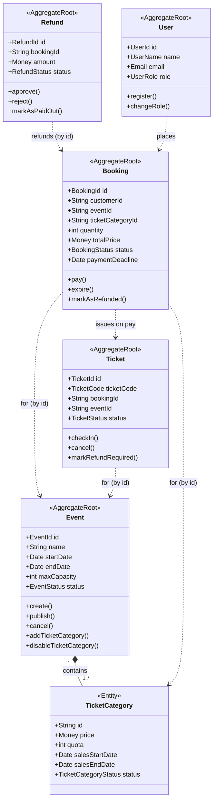

# Eventix -Event Ticketing & Booking System

An Event Ticketing & Booking System built with **Clean Architecture** and **Domain-Driven Design** tactical patterns. Event organizers create and publish events, customers book and pay for tickets, gate officers validate tickets at check-in, and administrators manage refund payouts.

Built with [NestJS](https://nestjs.com/), [TypeORM](https://typeorm.io/), and **PostgreSQL**.

## Architecture

The codebase is organized into the four Clean Architecture layers, each in its own folder under `src/`:

| Layer | Folder | Responsibility |
| --- | --- | --- |
| **Domain** | `src/domain` | Aggregates, entities, value objects, domain events, domain services, repository interfaces. No framework dependencies. |
| **Application** | `src/application` | Commands, command handlers, queries, query handlers, DTOs, and application service interfaces for external systems. |
| **Infrastructure** | `src/infrastructure` | TypeORM persistence, repository implementations, application service implementations, database connection, migrations, and seeds. |
| **Presentation** | `src/presentation` | REST API controllers and HTTP request/response mapping. |

Shared building blocks (`AggregateRoot`, `BaseEntity`, `ValueObject`, `Money`, domain-event publisher) live under `src/common`.

Bounded contexts: **User**, **Event**, **Booking** (including Tickets), and **Refund**.

## Aggregates and business rules

The domain is modeled as five aggregate roots. Each one owns its invariants and only mutates its own state through intention-revealing methods; rules that span aggregates are orchestrated by application handlers (and, where relevant, by subscribing to domain events).

### Event (`src/domain/event`)
Root: `Event`, with `TicketCategory` as a child entity inside the aggregate boundary (categories are created and disabled through the `Event`).

- An event cannot be created when the end date is before the start date, or when max capacity is not a positive integer.
- A new event starts as **Draft**.
- Adding a ticket category requires its sales period to end on or before the event start date, and the combined quota of all categories must never exceed the event's max capacity.
- Publishing is only allowed from **Draft**, requires at least one **active** ticket category, and re-checks that total quota ≤ capacity → becomes **Published**.
- Cancelling is rejected for already-cancelled or **Completed** events → becomes **Cancelled**.
- A ticket category can be disabled (soft-disable, kept for history); customers cannot buy from an inactive category.

### Booking (`src/domain/booking` - `Booking`)
Represents one customer's reservation for a quantity of tickets in a single category.

- Quantity must be a positive integer.
- Total price = `unitPrice × quantity + serviceFee`, represented with the `Money` value object (which forbids negative amounts). *(US9)*
- A new booking is **PendingPayment** with a payment deadline (default 15 minutes).
- **Pay**: only from PendingPayment, only before the deadline, and only when the paid amount equals the total price → becomes **Paid** and issues one `Ticket` per quantity. *(US10)*
- **Expire**: a Paid booking can never expire; only a PendingPayment booking past its deadline can → becomes **Expired**, releasing quota. *(US11)*
- **Refund**: only a Paid booking can be marked **Refunded**.

### Ticket (`src/domain/booking` - `Ticket`)
A single admission issued when a booking is paid; carries a unique `TicketCode`.

- Issued as **Active**.
- **Check-in**: the ticket must belong to the event being checked into, must not already be checked in, and must be Active → becomes **CheckedIn**. Invalid attempts throw and never change state. *(US13/US14)*
- A checked-in ticket cannot be cancelled; a cancelled ticket cannot be flipped to **RefundRequired** (used when an event is cancelled).

### Refund (`src/domain/refund` - `Refund`)
The lifecycle of a single refund request for a paid booking.

- Created in status **Requested**. *(US15)*
- **Approve**/**Reject**: only allowed from Requested; rejection requires a non-empty reason → **Approved** / **Rejected**. *(US16/US17)*
- **Mark paid out**: only from Approved and requires a payment reference → **PaidOut** (terminal). *(US18)*
- Cross-aggregate preconditions (booking is Paid, no ticket checked in, before the refund deadline, auto-allowed when the event is cancelled) and side effects (tickets → Cancelled, booking → Refunded on approval) are enforced/orchestrated in the application layer.

### User (`src/domain/user` - `User`)
Identity and authorization for the human actors.

- Registered with a name, a valid `Email` value object, and a `UserRole` (Event Organizer, Customer, Gate Officer, or System Admin).
- A user's role can be changed, raising `UserRoleChanged`.

### Domain model diagram

Solid diamonds (`*--`) are composition within an aggregate boundary; dashed arrows (`..>`) are references to *other* aggregates, which are held **by id** (not object references) per DDD guidance.



Value objects used across the model include `Money` (amount + currency, non-negative), the typed identifiers (`EventId`, `BookingId`, `TicketId`, `RefundId`, `UserId`), the status objects (`EventStatus`, `TicketCategoryStatus`, `BookingStatus`, `TicketStatus`, `RefundStatus`), `TicketCode`, `Email`, `UserName`, and `UserRole`.

## Prerequisites

- Node.js 20+
- [pnpm](https://pnpm.io/)
- PostgreSQL 14+

## Getting started

### 1. Install dependencies

```bash
pnpm install
```

### 2. Configure PostgreSQL

Create a database and a user for the application:

```sql
CREATE USER eventix WITH PASSWORD 'eventix';
CREATE DATABASE eventix OWNER eventix;
```

Copy the example environment file and adjust the values to match your PostgreSQL instance:

```bash
cp .env.example .env
```

`.env` variables:

| Variable | Default | Description |
| --- | --- | --- |
| `DATABASE_HOST` | `localhost` | PostgreSQL host |
| `DATABASE_PORT` | `5432` | PostgreSQL port |
| `DATABASE_USER` | `eventix` | Database user |
| `DATABASE_PASSWORD` | `eventix` | Database password |
| `DATABASE_NAME` | `eventix` | Database name |
| `PORT` | `3000` | HTTP port for the API (optional) |

### 3. Run database migrations

The schema is managed by TypeORM migrations (`src/infrastructure/database/migrations`). `synchronize` is disabled, so migrations are the source of truth.

```bash
# apply all pending migrations
pnpm migration:run

# revert the last migration
pnpm migration:revert

# generate a new migration from entity changes
pnpm migration:generate src/infrastructure/database/migrations/<Name>
```

Optionally seed sample data:

```bash
pnpm seed
```

### 4. Run the project

```bash
# development
pnpm start

# watch mode
pnpm start:dev

# production
pnpm build
pnpm start:prod
```

The API is served under the `/api` prefix (e.g. `http://localhost:3000/api`).

## Running tests

```bash
# domain & application unit tests
pnpm test

# watch mode
pnpm test:watch

# coverage
pnpm test:cov

# integration tests (require a running PostgreSQL)
pnpm test:integration
```

Domain unit tests live alongside the code as `*.spec.ts` files and cover the required cases (invalid event schedule, non-positive capacity, publishing without an active ticket category, quota exceeding capacity, zero-quantity bookings, payment after deadline, incorrect payment amount, paid bookings not expiring, double check-in, refund after check-in, refund approval state rules, and rejection reason requirement).

## Implemented user stories

| # | User Story | Application handler |
| --- | --- | --- |
| 1 | Create Event | `create-event` |
| 2 | Publish Event | `publish-event` |
| 3 | Cancel Event | `cancel-event` |
| 4 | Create Ticket Category | `create-ticket-category` |
| 5 | Disable Ticket Category | `disable-ticket-category` |
| 6 | View Available Events | `get-available-events` |
| 7 | View Event Details | `get-event-details` |
| 8 | Create Ticket Booking | `create-booking` |
| 9 | Calculate Booking Total Price | `Money` value object (in `create-booking` / `Booking`) |
| 10 | Pay Booking | `pay-booking` |
| 11 | Expire Booking | `expire-booking` |
| 12 | View Purchased Tickets | `get-customer-tickets` |
| 13 | Check In Ticket | `check-in-ticket` |
| 14 | Reject Invalid Ticket Check-in | `check-in-ticket` (validation rules) |
| 15 | Request Refund | `request-refund` |
| 16 | Approve Refund | `approve-refund` |
| 17 | Reject Refund | `reject-refund` |
| 18 | Mark Refund as Paid Out | `mark-refund-paid-out` |
| 19 | View Event Sales Report | `get-sales-report` |
| 20 | View Event Participants | `get-participants` |

Supporting user management (registration, role assignment, profile lookup) is also implemented under `src/application/user`.

## Implemented domain events

| Bounded context | Domain events |
| --- | --- |
| User | `UserRegistered`, `UserRoleChanged` |
| Event | `EventCreated`, `EventPublished`, `EventCancelled`, `TicketCategoryCreated`, `TicketCategoryDisabled` |
| Booking | `TicketReserved`, `BookingPaid`, `BookingExpired`, `TicketCheckedIn` |
| Refund | `RefundRequested`, `RefundApproved`, `RefundRejected`, `RefundPaidOut` |

## Application service interfaces

Interfaces for external systems are declared in the application layer and implemented in the infrastructure layer.

| Interface | Location | Implementation | Purpose |
| --- | --- | --- | --- |
| `IPaymentGateway` | `src/application/booking/services/payment-gateway.interface.ts` | `src/infrastructure/booking/services/payment-gateway.service.ts` | Charge booking payments via the payment gateway. |
| `IRefundPaymentService` | `src/application/refund/services/refund-payment.interface.ts` | `src/infrastructure/refund/services/refund-payment.service.ts` | Process refund payouts via the bank/refund service. |
| `IPasswordHasher` | `src/application/user/services/password-hasher.interface.ts` | `src/infrastructure/user/services/bcrypt-password-hasher.ts` | Hash and verify user passwords. |
| `INotificationService` | `src/application/notification/services/notification.interface.ts` | `src/infrastructure/notification/services/notification.service.ts` | Send email/WhatsApp notifications. |

## API documentation

The API is documented with **OpenAPI 3**, generated directly from the controllers and DTOs using [`@nestjs/swagger`](https://docs.nestjs.com/openapi/introduction) - so the documentation always reflects the actual code. There are two ways to consume it: the interactive Swagger UI (served by the running app) and the `openapi.json` spec file (committed at the repository root).

### View the interactive Swagger UI

Swagger UI lets you browse every endpoint, see request/response schemas, and call the API straight from the browser ("Try it out").

1. Start the app (see [Getting started](#4-run-the-project)):

   ```bash
   pnpm start:dev
   ```

2. Open [`http://localhost:3000/api/docs`](http://localhost:3000/api/docs) in your browser.
3. Expand an endpoint, click **Try it out**, fill in the parameters/body, and **Execute**. Requests are sent to the live API under the `/api` prefix.

The raw spec served by the app is also available at `http://localhost:3000/api/docs-json`.

### Use the `openapi.json` spec file

[`openapi.json`](openapi.json) is a self-contained OpenAPI 3 document you can use without running the app. Regenerate it any time (no database required) with:

```bash
pnpm docs:generate
```

This builds the project and writes `openapi.json` from the live module graph. You can then:

- **Import it into an API client** - in Bruno, Postman, or Insomnia choose *Import* and select `openapi.json` to get a ready-made collection of all endpoints.
- **Generate client SDKs or a static docs site** - feed it to tools such as [`openapi-generator`](https://openapi-generator.tech/) or [Redoc](https://github.com/Redocly/redoc) (`npx @redocly/cli preview-docs openapi.json`).
- **Preview it online** - paste its contents into the [Swagger Editor](https://editor.swagger.io/).

### REST API endpoints

All routes are prefixed with `/api`.

### Users - `/users`
- `POST /users` - register a user
- `PATCH /users/:id/role` - change a user's role
- `GET /users/by-email` - look up a user by email
- `GET /users/:id` - get a user profile

### Events - `/events`
- `POST /events` - create an event
- `POST /events/:id/publish` - publish an event
- `POST /events/:id/cancel` - cancel an event
- `GET /events` - list available (published) events, filterable by date/location
- `GET /events/:id` - event details
- `GET /events/:id/participants` - participant list
- `GET /events/:id/sales-report` - sales report

### Ticket categories - `/events/:eventId/ticket-categories`
- `POST /events/:eventId/ticket-categories` - create a ticket category
- `POST /events/:eventId/ticket-categories/:categoryId/disable` - disable a ticket category

### Bookings - `/bookings`
- `POST /bookings` - create a booking
- `POST /bookings/:id/pay` - pay a booking
- `POST /bookings/:id/expire` - expire an unpaid booking

### Tickets - `/tickets`
- `GET /tickets` - list a customer's purchased tickets
- `POST /tickets/check-in` - check in a ticket

### Refunds - `/refunds`
- `POST /refunds` - request a refund
- `POST /refunds/:id/approve` - approve a refund
- `POST /refunds/:id/reject` - reject a refund
- `POST /refunds/:id/pay-out` - mark a refund as paid out

## Project scripts

| Script | Description |
| --- | --- |
| `pnpm start` / `start:dev` / `start:prod` | Run the API |
| `pnpm build` | Compile to `dist/` |
| `pnpm test` / `test:cov` / `test:integration` | Run tests |
| `pnpm migration:run` / `migration:revert` / `migration:generate` | Manage migrations |
| `pnpm seed` | Seed sample data |
| `pnpm docs:generate` | Generate `openapi.json` from the code |
| `pnpm lint` / `format` | Lint and format |
